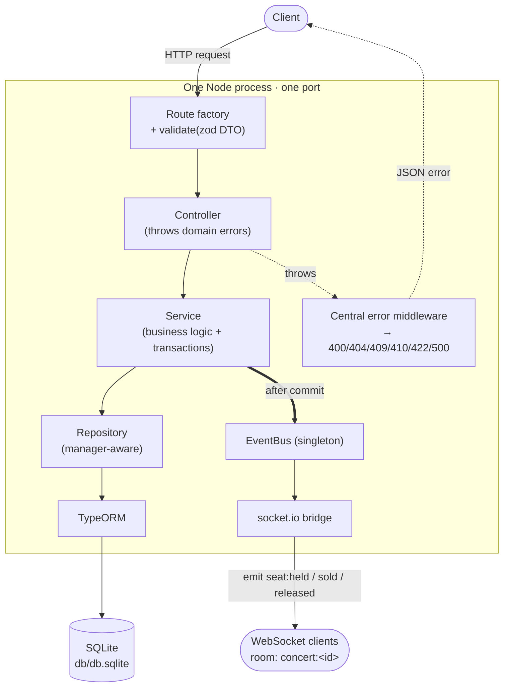
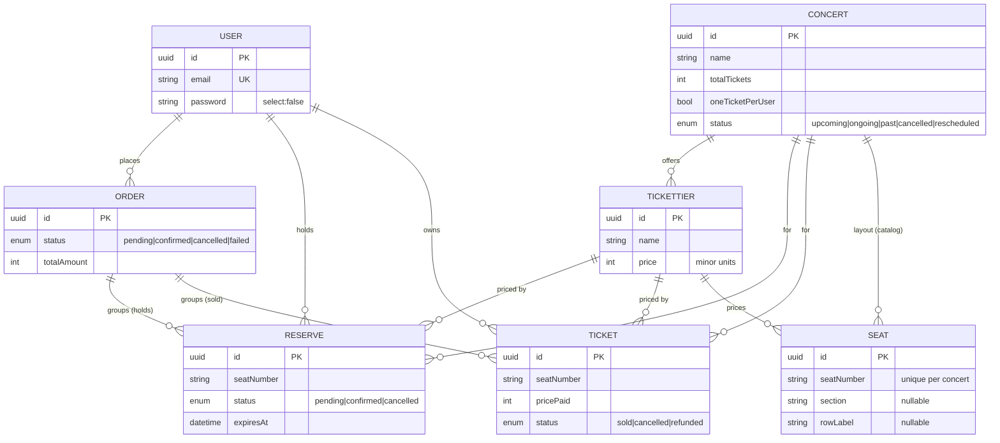

# 🎟️ Concert Ticketing System

[](https://github.com/LuLuKar05/ticketing-system/actions/workflows/ci.yml)


A backend API for concert ticketing built around the hardest problem any ticketing platform faces: **two people must never end up owning the same seat** — while a buyer who has already reached checkout should never _lose_ their seat to someone faster.

It solves this with a **hard-hold, create-on-pay** reservation model in which seat exclusivity is **enforced by the database itself** (not by application-level checks that can race), purchases are **atomic and all-or-nothing**, abandoned holds are **automatically released**, and every seat-state change is **pushed to clients in real time over WebSockets**.

> This is a deep-dive learning project. The emphasis throughout is on three things that matter in real systems: **correctness under concurrency**, a **clean, testable layered architecture**, and a **thorough multi-layer automated test suite** (85 tests spanning unit, integration, and API).

---

## Table of contents

- [What it does](#what-it-does)
- [The core problem & the model](#the-core-problem--the-model)
- [Architecture](#architecture)
- [Tech stack](#tech-stack)
- [Data model](#data-model)
- [Concurrency & correctness](#concurrency--correctness-the-heart-of-the-project)
- [Request lifecycle, end to end](#request-lifecycle-end-to-end)
- [Getting started](#getting-started)
- [API reference](#api-reference)
- [Real-time (WebSockets)](#real-time-websockets)
- [Testing](#testing)
- [Project structure](#project-structure)
- [Design decisions & trade-offs](#design-decisions--trade-offs)
- [Roadmap](#roadmap)
- ["What did you do on this project?"](#what-did-you-do-on-this-project--interview-summary)

---

## What it does

- **Browse concerts** and their **ticket tiers.** A concert has one or more tiers (e.g. _VIP_, _General_), each with its own **price**. A tier's **capacity is derived** from the seat catalog (`COUNT(seat)` in that tier) — there is no stored quantity to drift out of sync.
- **A seat catalog per concert.** An admin imports the venue **layout** (`POST /concerts/:id/seats`); every seat belongs to a tier. Clients fetch the **live seat map** (`GET /concerts/:id/seats`) — each seat reported as `available` / `held` / `sold` — as the baseline the WebSocket deltas apply to.
- **Hold specific seats** for a short window (a **5-minute TTL**). A hold is **exclusive** — while you hold seat `A10`, nobody else can hold _or_ buy it. This is the key UX difference from a naive "everyone competes, first-to-pay-wins" design, where you can enter your card details and still lose the seat.
- **Pay to convert holds into owned tickets.** A multi-seat order is **all-or-nothing**: if any one seat in the order can't be completed, the _entire_ purchase rolls back — you never get a half-finished order with 3 of 4 seats charged.
- **Automatic cleanup.** Holds that are never paid for expire, and a background **sweeper** cancels them and frees their seats — no manual intervention, no leaked inventory.
- **Live seat maps.** Every client viewing a concert receives real-time `held` / `sold` / `released` events for that concert's seats, so a seat greys out or frees up on everyone's screen the instant it changes.

---

## The core problem & the model

Ticketing is, at its core, a **concurrency** problem: many users compete for a small, fixed set of seats at the same instant. The naive approach — "read whether the seat is free, then mark it taken" — has a fatal race: two requests can both read _free_ before either writes _taken_. This project uses the model most production ticketing sites use, and pushes the correctness guarantee down into the database.

**Hard-hold · create-on-pay · assigned seats**

| Concept            | What it means                                                                                                                                                   | Why                                                       |
| ------------------ | --------------------------------------------------------------------------------------------------------------------------------------------------------------- | --------------------------------------------------------- |
| **Hard hold**      | Selecting a seat grants an _exclusive_ hold; others are blocked from it for the TTL.                                                                            | Buyers don't lose a seat after starting checkout.         |
| **Create-on-pay**  | A `Ticket` row exists **only when SOLD**. Unsold seats are not rows. During a hold, the seat identity `(concert, tier, seatNumber)` lives on the **`Reserve`**. | No placeholder inventory to pre-generate or keep in sync. |
| **Assigned seats** | Real seat labels (`A10`, `B5`), unique _per concert_.                                                                                                           | Matches how venues actually sell.                         |
| **Order**          | Groups the reserves/tickets of one purchase so payment is a single **all-or-nothing** unit.                                                                     | Multi-seat group bookings behave correctly.               |

The lifecycle of a seat:

```
select seats ──▶ HOLD   (create an Order + one PENDING Reserve per seat, 5-min TTL)
             ──▶ PAY    (create SOLD Tickets, confirm the Reserves)
             ──▶ EXPIRE (a sweeper cancels stale PENDING holds → the seat frees itself)
```

Because the hold's uniqueness index is **partial** (it only applies to `status='pending'`), simply flipping a hold to `cancelled` **frees the seat automatically** — there's no ticket to delete and no stock counter to restore, because **there is no stock counter at all**: capacity is derived from the seat catalog, and availability from the tickets/holds themselves. That self-freeing property is a direct payoff of the model.

---

## Architecture

A strict **layered architecture** — each layer depends only on the _interface_ of the layer directly beneath it, and no layer reaches past its neighbor.



The cross-cutting pieces that make this work:

- **Dependency injection (tsyringe).** Every class is `@injectable()` and depends on **interfaces** resolved by string tokens registered in `container.ts`. Because nothing news-up its own dependencies, tests can substitute fakes or an in-memory database with zero changes to production code.
- **Route-factory pattern.** Routers and `createApp({ controllers })` receive their dependencies as **parameters** and never import the DI container. This decouples wiring from the app and lets the entire Express app be constructed in a test without a real server or DB.
- **Central error handling.** Services `throw` typed domain errors (`SeatsUnavailableError`, `NotFoundError`, `ReserveExpiredError`, …). A single 4-argument Express middleware maps each to the right HTTP status. Controllers therefore contain **no** try/catch and **no** HTTP-status logic — they just call a service and shape the success response.
- **Manager-aware repositories.** A repository method optionally accepts an `EntityManager`. Pass a transaction's manager and the write enlists in that transaction; omit it and the method runs standalone. This is what lets the codebase keep a clean repository layer _and_ get true atomicity across multiple writes.
- **EventBus → WebSockets.** After a transaction commits, a service publishes a domain event to an in-process **EventBus**; a socket.io **bridge** subscribes and forwards it to the concert's room. Services never import socket.io, which keeps them DB-focused and testable — and makes the bus a clean seam for a future CQRS read model.

---

## Tech stack

| Area                 | Choice                                        | Notes                                               |
| -------------------- | --------------------------------------------- | --------------------------------------------------- |
| Language / runtime   | **TypeScript**, **Node.js**                   | strict compiler settings                            |
| HTTP framework       | **Express 5**                                 | native async error forwarding                       |
| ORM / database       | **TypeORM** + **better-sqlite3** (SQLite)     | migrations, `synchronize:false` in prod             |
| Dependency injection | **tsyringe** (`reflect-metadata`)             | interface tokens, singletons                        |
| Validation           | **zod**                                       | per-route DTOs + a generic `validate()` middleware  |
| Real-time            | **socket.io**                                 | rooms per concert, env-driven CORS allowlist        |
| API docs             | **swagger-ui-express** + **zod-openapi**      | OpenAPI 3.1 generated from the zod DTOs             |
| Packaging            | **Docker** (multi-stage) + **docker compose** | migrate-on-start, volume-backed SQLite, healthcheck |
| Testing              | **Jest** + **ts-jest** + **supertest**        | unit / integration / API                            |
| Config               | **dotenv**                                    | `PORT`, `CORS_ORIGINS`                              |

---

## Data model



Notes on the model:

- **`Reserve` and `Ticket` are siblings under `Order`** — a `Reserve` never points at a `Ticket`. Each independently carries its own seat identity `(concert, tier, seatNumber)`. At payment, a reserve's seat info is used to _create_ the matching ticket.
- **`Seat` is the catalog, never the state.** It stores the venue _layout_ (which seats exist, which tier each belongs to) — a seat's live status is always **derived**: `sold` if a Ticket exists, `held` if a pending Reserve exists, else `available`. Holding a seat resolves its tier **from the catalog, server-side** — the client sends only seat numbers, so it can't pick a cheaper tier for a seat. See [SEATMAP.md](./SEATMAP.md).
- Common columns (`id`, `createdAt`, `updatedAt`) are inherited from a shared **`AbstractEntity`**.
- Enums are stored as `text` (SQLite has no native enum type); `seatNumber` is `text` so labels like `'A10'` work; money is stored as **integer minor units** to avoid floating-point drift.

**The two exclusivity guarantees — enforced by the database, not the app:**

| Index                      | Rule                                                              | Guarantees                           |
| -------------------------- | ----------------------------------------------------------------- | ------------------------------------ |
| `Uqi_reserve_concert_seat` | **UNIQUE** `(concertId, seatNumber)` **`WHERE status='pending'`** | at most **one active hold** per seat |
| `Uq_ticket_concert_seat`   | **UNIQUE** `(concertId, seatNumber)`                              | at most **one sale** per seat        |

The partial condition on the first index is what makes cancelled/expired holds stop blocking a seat — the moment a hold isn't `pending`, it leaves the index and the seat is free again.

---

## Concurrency & correctness (the heart of the project)

This is the part I'd most want to talk through in a review.

- **Exclusivity is the database's job, not the application's.** The app _does_ run pre-checks (`findHeldSeatNumbers`, `findSoldSeatNumbers`) — but only for **UX**, so it can report _all_ unavailable seats up front. The **authoritative** guard is the `INSERT` hitting a unique index. This matters because any "check then act" in application code has a **time-of-check-to-time-of-use** race: two requests can both pass the check before either writes. A unique constraint cannot be raced — the second `INSERT` simply fails, and the code maps that failure to a clean `409`.
- **Atomic, all-or-nothing operations.** Holding N seats (create the order + N reserves) and paying for N seats (create N tickets + confirm N reserves) each run inside a **single transaction** via `createQueryRunner`. A throw anywhere rolls the whole thing back — proven by tests that stub a mid-order failure and assert nothing was created.
- **No pessimistic locks — on purpose.** SQLite has **no row-level locking** (it locks the whole database, single-writer). `SELECT … FOR UPDATE` isn't available, so the design leans on **unique constraints + conditional writes**, which are race-proof on _any_ engine. The code documents exactly where a row lock _would_ go once the project moves to Postgres — so the concurrency strategy is deliberate and portable, not accidental.
- **Emit after commit, never inside the transaction.** WebSocket events are published only _after_ the transaction commits (the `return` is moved past the `try/finally`, so it's reached only on success). A rollback therefore can never produce a false "seat sold" broadcast.
- **Self-healing inventory.** A background **sweeper** (`setInterval`, 60s, guarded against overlapping runs, and wrapped so a failure never crashes the process) cancels expired PENDING holds in one transaction, then cancels any order left with no live holds. Because of the partial index, this **frees seats automatically**.

---

## Request lifecycle, end to end

A `POST /reserves` that hits an already-held seat, traced through every layer:

```mermaid
sequenceDiagram
    participant C as Client
    participant R as Route + validate(zod)
    participant Ctl as ReserveController
    participant S as ReserveService (txn)
    participant DB as SQLite
    participant E as Error middleware

    C->>R: POST /reserves { userId, concertId, seats }
    R->>R: zod validation (400 if invalid)
    R->>Ctl: reserveTickets(req,res)
    Ctl->>S: reserveTickets({...})
    S->>DB: pre-check sold/held seats
    S->>DB: BEGIN; create Order; INSERT reserves
    DB-->>S: UNIQUE constraint failed (seat held)
    S->>DB: ROLLBACK
    S-->>Ctl: throw SeatsUnavailableError(['A1'],'held')
    Ctl-->>E: (error propagates)
    E-->>C: 409 { seatNumbers:['A1'], reason:'held' }
```

---

## Getting started

### Prerequisites

- **Node.js** (a modern LTS) and **npm** — or just **Docker** (see [Run with Docker](#run-with-docker)).

### Install

```bash
npm install
```

### Configure

Create a `.env` file in the project root:

```env
PORT=5000
# Comma-separated origins allowed to open a WebSocket connection.
# Empty = deny all cross-origin (production-safe default).
CORS_ORIGINS=http://localhost:5173,http://localhost:3000
# Log every SQL query (opt-in, dev only).
DB_LOGGING=true
```

### Database & migrations

The database is SQLite at `db/db.sqlite`, configured with `synchronize: false` — all schema changes go through **migrations**, never auto-sync.

```bash
# create a migration from your current entity changes
npm run migration:generate -- src/migrations/MyChange

# apply migrations — BUILD FIRST (the migrations path points at compiled dist/)
npm run build && npm run migration:run

# roll back the most recent migration
npm run migration:revert
```

> **Why build-before-migrate:** the DataSource resolves migrations from `dist/migrations/**/*.js`, so `migration:run` executes the _compiled_ migration. `migration:generate`, on the other hand, reads the `.ts` entities directly and needs no build.

### Run

```bash
npm run dev                  # compile + watch + restart on change (development)
npm run build && npm start   # production

npm run typecheck            # tsc --noEmit (src)
npm run lint                 # ESLint (flat config, type-checked rules)
npm run format               # Prettier --write (format:check to verify only)
```

> All of these run in **CI** (`.github/workflows/ci.yml`, Node 26) on every push/PR to `main`:
> `npm ci → typecheck → lint → format:check → build → test`.

On startup the console shows the data source initialize, the HTTP server bind, the **sweeper** start, and the **WebSocket** server attach — all on the same port. `SIGINT`/`SIGTERM` trigger a **graceful shutdown** (stop the sweeper, close sockets, close the server, destroy the data source).

### Run with Docker

```bash
docker compose up --build    # build + migrate + serve on http://localhost:5000
```

- **Multi-stage image** (`Dockerfile`): a build stage compiles TypeScript; the runtime stage carries only production deps + `dist/`. Base is `node:26-bookworm-slim` (glibc) so `better-sqlite3`'s prebuilt binaries work without a compiler toolchain.
- **Migrations run on startup** via `npm run migration:run:prod` (plain TypeORM CLI against the compiled `dist/data-source.js` — no ts-node in the image), then the container `exec`s into `node dist/server.js` so **SIGTERM reaches the app directly** and the graceful shutdown actually runs on `docker stop`.
- **Data persists** on a named volume mounted at `/app/db` (the SQLite file). Remove it with `docker compose down -v` if you want a truly fresh database.
- **`GET /health`** is the liveness probe wired into the image's `HEALTHCHECK` (also handy for orchestrators/uptime monitors).
- Env (`PORT`, `CORS_ORIGINS`, `DB_LOGGING`) is set in `docker-compose.yml`; per-query SQL logging is now **opt-in** via `DB_LOGGING=true` everywhere (dev default was moved off `always-on`).

---

## API reference

Base path: **`/api/v1`**. All responses are JSON of the form `{ status, message, data? }`.

> **Interactive docs:** Swagger UI at **`/api/v1/docs`**, raw spec at **`/api/v1/openapi.json`** (import into Postman/Insomnia). The spec is **generated from the same zod DTOs the routes validate with** (`src/docs/openapi.ts`), so the documented request shapes cannot drift from what the API actually enforces — and a test asserts every mounted path is documented.

> **Auth note:** `userId` is currently passed in the request body. Authentication (JWT, with `userId` derived from a verified token) is fully specified as the next phase — see [Roadmap](#roadmap). This is called out honestly rather than hidden.

### `GET /concerts` · `GET /concerts/:id`

List concerts (optionally filtered by `?status=`, validated against the status enum) and fetch a single concert by id (with its tiers).

### `GET /concerts/:id/seats` — the live seat map

The availability **read model**: the seat catalog merged with live state. Each seat comes back as `{ seatNumber, section, row, tier: { id, name, price }, status: 'available' | 'held' | 'sold' }` — the baseline a client renders, then applies the WebSocket deltas onto.

### `POST /concerts/:id/seats` — import a seat map (admin)

Full-replace of a concert's layout from one JSON document; each seat references its tier **by name**, resolved against that concert's tiers. Refused with `409` once any seat is sold or held. _(Unauthenticated until Phase 6a — see Roadmap.)_

```jsonc
// request
{ "seats": [ { "seatNumber": "A1", "section": "A", "row": "1", "tierName": "VIP" }, … ] }
```

### `POST /reserves` — hold seats

Seats are **seat numbers only** — each seat's tier (and price) is derived server-side from the seat catalog.

```jsonc
// request
{
  "userId": "<uuid>",
  "concertId": "<uuid>",
  "seats": ["A1", "A2"]
}
// 201 Created
{ "status": "success", "message": "Seats held successfully", "data": { "order": { "id": "…", "status": "pending" } } }
```

| Status | When                                                                                                                 |
| ------ | -------------------------------------------------------------------------------------------------------------------- |
| `400`  | body fails validation (missing/invalid fields, empty or duplicate `seats`), or a seat isn't in the concert's catalog |
| `404`  | concert not found                                                                                                    |
| `409`  | one or more seats already taken — body includes `{ seatNumbers, reason: 'sold' \| 'held' }`                          |

### `POST /orders/:id/confirm` — pay

```jsonc
// request  { "userId": "<uuid>" }
// 200 OK
{ "status": "success", "message": "Order confirmed and tickets issued", "data": { "order": { "status": "confirmed", "totalAmount": 10000 }, "tickets": [ … ] } }
```

| Status | When                                                   |
| ------ | ------------------------------------------------------ |
| `400`  | invalid order id or body                               |
| `404`  | order not found                                        |
| `409`  | a seat was sold out from under the order (rolls back)  |
| `410`  | a hold in the order expired                            |
| `422`  | order not payable (e.g. already confirmed / cancelled) |

---

## Real-time (WebSockets)

socket.io shares the same HTTP port as the REST API. A client **joins a per-concert room** and then receives that concert's seat-state events:

```js
const socket = io('http://localhost:5000');

socket.on('connect', () => socket.emit('join', { concertId: '<uuid>' }));

socket.on('seat:held', (d) => console.log('held', d)); // { concertId, seatNumbers }
socket.on('seat:sold', (d) => console.log('sold', d));
socket.on('seat:released', (d) => console.log('released', d));
```

- **`seat:held`** is emitted after a hold commits, **`seat:sold`** after a payment commits, **`seat:released`** after the sweeper frees expired holds.
- All events fire **after the transaction commits**, so a rollback never yields a false event.
- The **room** (`concert:<id>`) means a client only receives updates for the concert it's currently viewing.
- Origins allowed to connect are controlled by the `CORS_ORIGINS` allowlist.

---

## Testing

```bash
npm test    # Jest — 85 tests across three layers
```

- **Runner: Jest + ts-jest.** This is a deliberate, informed choice: ts-jest compiles with **`tsc`**, which emits the `emitDecoratorMetadata` that **TypeORM entities and tsyringe DI depend on** at runtime. esbuild-based runners (Vitest's default, `tsx`) **do not** emit that metadata, so DI resolution and entity mapping silently break under them. `tsconfig.test.json` overrides `module → commonjs` for Jest; `reflect-metadata` is loaded via `setupFiles`.
- **Test database: in-memory + `synchronize:true`.** Each test spins up a fresh `:memory:` SQLite DataSource whose schema is built directly from the entity decorators — **including the partial/unique indexes**, so exclusivity is genuinely exercised, not mocked away. A new database per test gives complete isolation; production stays `synchronize:false`.
- **DI in tests.** A tsyringe **child container** (`tests/helpers/testContainer.ts`) mirrors production registration but is wired to the test DataSource, so tests resolve _real_ services/controllers against the in-memory DB.

Three layers, each answering a different question:

| Layer           | Tooling                                             | Answers                                                                                                                                  |
| --------------- | --------------------------------------------------- | ---------------------------------------------------------------------------------------------------------------------------------------- |
| **unit**        | `jest.fn()` mocks + a fake query-runner (no DB)     | _Is the branching and error-mapping logic correct?_ (UNIQUE → `SeatsUnavailableError`, expiry, rollback/commit, publish-only-on-success) |
| **integration** | real services/repos + in-memory SQLite              | _Do the transactions and DB constraints actually hold?_ (exclusivity, all-or-nothing, sold-race rollback, sweeper frees seats)           |
| **api**         | **supertest** against `createApp({...})` in-process | _Does the HTTP contract match?_ (status codes, JSON shape, validation, error mapping)                                                    |

---

## Project structure

```
src/
  entities/        Concert · TicketTier · Seat · Order · Reserve · Ticket · User · AbstractEntity
  repositories/    data access (manager-aware: methods accept an EntityManager to join a txn)
  services/        ReserveService · TicketService · SeatService · SweeperService · EventBus · ConcertService
  controllers/     Concert · Reserve · Order · Seat  (throw domain errors; no HTTP-mapping logic)
  routes/          create*Router factories
  dtos/            zod schemas + inferred types
  docs/            openapi.ts — OpenAPI 3.1 document generated from the DTOs
  middleware/      validate() factory
  sockets/         socketServer.ts  (EventBus → socket.io bridge)
  migrations/      TypeORM migrations
  error.ts         typed domain errors
  app.ts           createApp() — routers + 404 + central error handler
  container.ts     tsyringe registrations
  data-source.ts   TypeORM DataSource
  server.ts        bootstrap: DB → DI → HTTP → sockets → sweeper → graceful shutdown
tests/
  unit/  integration/  api/  helpers/    (Jest + ts-jest + supertest)
deploy:
  Dockerfile         multi-stage build (compile → slim runtime, migrate-on-start, healthcheck)
  docker-compose.yml port + env + named volume for the SQLite file
  .dockerignore      keeps local db/node_modules/docs out of the build context
docs:
  README.md        this file
  CLAUDE.md        living architecture doc + phase-by-phase build log + deferred specs
  SEATMAP.md       seat-catalog design: derived status, import format, GA mode plan
  CODE_REVIEW.md   living review log: flaws, alternatives, trade-offs, resolution history
```

---

## Design decisions & trade-offs

Every significant choice was made deliberately, with the trade-off understood and documented:

- **Hard-hold vs. optimistic "first-to-pay-wins".** Chosen for the friendlier UX (no losing a seat after checkout). The cost — seats briefly locked by people who abandon checkout — is mitigated by the TTL and the sweeper.
- **Create-on-pay + a seat _catalog_, not seat _state_.** Tickets still exist only when SOLD — but "which seats exist" is now a stored **layout** (the `Seat` table), imported per concert. The catalog never stores availability; status stays _derived_ from sold tickets + pending holds. This closes seat validity, per-tier capacity, and the tier↔seat binding in one table without abandoning create-on-pay (see [SEATMAP.md](./SEATMAP.md)).
- **DB constraints vs. app-level locks/checks.** Unique indexes are race-proof and portable; app checks are only for UX. This sidesteps SQLite's lack of row locking entirely, and is the single most important correctness decision in the project.
- **EventBus abstraction vs. services calling socket.io directly.** Keeps services DB-focused and unit-testable, and turns the bus into the natural seam for a future CQRS read model — new subscribers can be added without touching services.
- **Manager-aware repositories.** Lets the codebase keep a clean repository layer _and_ still compose multiple writes into one atomic transaction — the alternative (raw `manager` calls scattered in services) would leak persistence concerns upward.
- **String DI tokens.** Simple and readable, but they trade compile-time safety for a small runtime risk (an early bug from a commented-out registration is documented in `CODE_REVIEW.md`); `Symbol`/`InjectionToken` constants are the hardening step.
- **SQLite for now.** Great for a focused learning project and for fast in-memory tests; the concurrency design is written so a Postgres move is a config swap plus adding the row locks the code already marks.

---

## Roadmap

Fully specified in `CLAUDE.md`, deferred by choice:

- **Auth (Phase 6a):** register/login with **bcrypt + JWT**; `userId` comes from a verified token instead of the request body.
- **Payment gateway (Phase 6b):** an `IPaymentGateway` abstraction (mock now, Stripe later); charge with an **idempotency key = `orderId`** _before_ issuing tickets, with a documented compensation path for the "charged but commit failed" edge.
- **Retention / purge:** a cron-scheduled job to archive/hard-delete old _terminal_ rows (distinct from the status-only sweeper), never touching audit-relevant `CONFIRMED`/`SOLD` records.
- **CQRS read model:** a transactional **outbox** + projectors behind the existing `EventBus` for fast, replayable read views.
- **Hardening:** `CHECK` constraints on enum columns; migrate to **Postgres** to unlock row-level locking.

---

## "What did you do on this project?" — interview summary

> I built a **concert-ticketing backend in TypeScript** focused on the concurrency problem at the core of ticketing — never selling the same seat twice, without making a buyer lose a seat mid-checkout — and I made that correctness guarantee the **database's** responsibility rather than the application's.

**Things I can speak to in depth:**

- **Designed the reservation model** — a **hard-hold, create-on-pay** system with assigned seats and an `Order` that groups multi-seat purchases into a single **all-or-nothing** transaction.
- **Made correctness structural.** Seat exclusivity is enforced by **partial/unique indexes**, not application `if`-checks (which carry a time-of-check-to-time-of-use race). App-level pre-checks exist only to give the user a nice "these seats are taken" message; the unbreakable guard is the constrained `INSERT`.
- **Reasoned about platform limits.** I recognized SQLite has **no row-level locking**, so I used unique constraints + conditional writes — race-proof on any engine — instead of pessimistic locks, and documented exactly where a `FOR UPDATE` lock _would_ go on Postgres.
- **Built a clean, layered, DI-driven architecture** — Route → Controller → Service → Repository — with tsyringe, route factories, zod validation, and a single central error-handling middleware (controllers carry no try/catch).
- **Handled transactions correctly** using `createQueryRunner` and **manager-aware repositories**, so repository methods can enlist in a caller's transaction and every multi-write operation is atomic.
- **Added self-healing inventory** — a guarded background **sweeper** that expires abandoned holds; the partial index means cancelling a hold frees its seat with no extra work.
- **Delivered real-time updates** via an in-process **EventBus** that decouples services from **socket.io**, broadcasting seat events to per-concert rooms **after commit** — and I chose that abstraction deliberately as the seam for a future CQRS read model.
- **Wrote a genuine test suite** — **85 tests** across **unit** (mocked deps), **integration** (in-memory SQLite), and **API** (supertest) — and diagnosed a real toolchain gotcha (esbuild runners don't emit decorator metadata, so I used **Jest + ts-jest**).
- **Practiced production hygiene** — migrations with a build-before-migrate workflow, graceful shutdown, env-driven config and a CORS allowlist, and living documentation (`CLAUDE.md`, `CODE_REVIEW.md`, this README).

**What I took away:** how to choose the _right_ concurrency primitive for the platform (DB constraint vs. lock vs. transaction), how to structure a codebase so it's testable by construction, and how to make **deliberate, documented trade-offs** rather than accidental ones.
